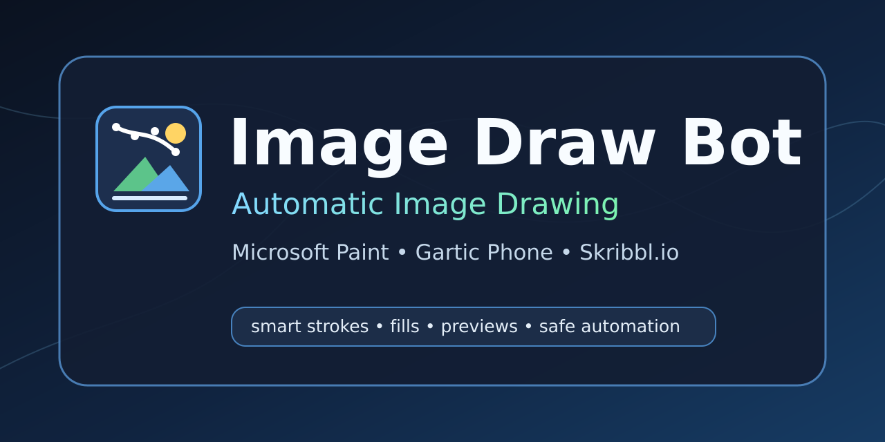

# Image Draw Bot — automatic image drawing for Windows



[](https://github.com/Vxiey/Image-Draw-Bot/actions/workflows/ci.yml)


**Image Draw Bot converts pictures into mouse strokes, contours, fills and exact RGB color selections for Microsoft Paint, Gartic Phone, Skribbl.io and other drawing canvases.**

Image Draw Bot is a source-available Windows desktop app for automatic image drawing. It uses local image processing, deterministic render planning and safe mouse automation to recreate images in target drawing apps. It does not generate AI images, upload artwork or require cloud processing.

## Why use Image Draw Bot?

| Use case | What Image Draw Bot does |
| --- | --- |
| **Microsoft Paint automation** | Detects the Paint canvas, prepares Pencil/Fill, calibrates RGB fields and draws with exact colors where possible. |
| **Image-to-strokes conversion** | Converts source images into optimized mouse paths, connected runs, outlines, fill regions and correction passes. |
| **Fast drawing rounds** | Uses Extra Fast, Quick Sketch and Auto Hybrid planning to keep recognizable shapes under tight time budgets. |
| **Pixel-focused rendering** | Uses Pixel Accurate planning, coverage maps, error checks and protected-detail logic for higher fidelity. |
| **Drawing game canvases** | Supports calibrated browser-canvas workflows for Gartic Phone, Skribbl.io and similar drawing apps. |
| **Local privacy** | Processes images locally with no telemetry; network use is limited to explicit features such as updates or URL loading. |

## Download for Windows

Source version **v1.0.144-rc8** fixes image-palette use in Pixel Accurate; its Windows build is being validated.

Download **Image Draw Bot v1.0.144-rc7** for Windows 10/11 x64.
The installer and portable ZIP include Python and use the Image Draw Bot name.

| Download | How to use it |
| --- | --- |
| [Windows installer — recommended](https://github.com/Vxiey/Image-Draw-Bot/releases/download/v1.0.144-rc7/ImageDrawBot-1.0.144-rc7-Windows-x64-Setup.exe) | Run Setup, then open Image Draw Bot. Python is included. |
| [Portable Windows ZIP](https://github.com/Vxiey/Image-Draw-Bot/releases/download/v1.0.144-rc7/ImageDrawBot-1.0.144-rc7-Windows-x64.zip) | Extract the entire ZIP and run ImageDrawBot/ImageDrawBot.exe. Keep its supporting files together. |
| [SHA-256 checksums](https://github.com/Vxiey/Image-Draw-Bot/releases/download/v1.0.144-rc7/ImageDrawBot-1.0.144-rc7-SHA256.txt) | Verify the downloaded files. |

[All releases](https://github.com/Vxiey/Image-Draw-Bot/releases) ·
[Release notes](RELEASE-NOTES-v1.0.144-rc7.md) ·
[Setup and troubleshooting](README-INDEX.md) · [Frequently asked questions](docs/FAQ.md)

## Guides and help

- [First drawing](docs/GETTING-STARTED.md)
- [Wiki: installation, target setup and troubleshooting](https://github.com/Vxiey/Image-Draw-Bot/wiki)
- [Setting explanations and glossary](https://github.com/Vxiey/Image-Draw-Bot/wiki/Settings-and-Tooltips)

Inside the app, open **Get started** for the six-section guide or click **?** beside a setting. **Setup wizard** checks the selected profile requirements.

## Core features

- Automatic drawing bot for Windows 10/11 x64.
- Microsoft Paint canvas detection, Pencil/Fill setup and RGB color calibration.
- Image-to-mouse-path rendering with contours, connected regions, fills and scanline fallback.
- Extra Fast, Balanced, Pixel Accurate and Auto Hybrid drawing modes.
- Adaptive detail preservation for small shapes, eyes, outlines, text-like forms and high-contrast edges.
- Palette matching, exact custom RGB colors, color batching and preview diagnostics.
- Optional CUDA/OpenCL acceleration with CPU fallback.
- Per-target profiles for Paint, Gartic Phone, Skribbl.io and other calibrated canvases.
- Manual preview, estimated draw time, stop/pause hotkeys and safety guards.

### Picture custom palette for Microsoft Paint

After loading an image and calibrating Paint, use **Custom color palette for picture** to analyze the current picture, prepare its important exact RGB colors through **Edit colors**, and cache that image-specific palette. The action is Paint-only, bounded and cancel-safe. Exact RGB control calibration is saved independently from canvas detection, so a clipped Paint canvas can still use manual area selection without losing custom-color support.

Requires **Windows 10/11, 64-bit**. Run Image Draw Bot and the target app at the same
privilege level, normally without administrator rights.

**Published Windows downloads are unsigned.** Windows may display “Unknown publisher” or
SmartScreen warnings, and Smart App Control can block execution. Code signing
has not been activated. Passing build tests does not mean Windows app-control
approval.

## Quick start: Microsoft Paint

1. Open Image Draw Bot and choose **Microsoft Paint**.
2. Load, paste or drop an image.
3. Keep one Paint window with a blank, fully visible canvas. If no Paint window
   is visible, automatic preparation attempts to open it.
4. Press **Prepare Paint & draw**.

Before drawing, the app selects Pencil and 1 px, detects the canvas and palette,
and opens **Edit colors / Redigera färger** to calibrate the RGB fields and OK
button. It dismisses the dialog after calibration, then uses the fresh controls
for custom colors during drawing.

**No mandatory small test, preview or separate unlock is required for Paint.**
Use **Prepare Paint automatically** to prepare without drawing. Manual
calibration and diagnostic controls remain available.

Automatic preparation currently matches Swedish/English modern Paint controls,
requires RGB mode in the color dialog, and uses the recognized light ribbon
layout. Covered controls, multiple windows, a nonblank/clipped canvas or an
unsupported layout stop preparation rather than guessing. It does not clear,
resize or replace your document. Live end-to-end automation still needs testing
on the user's Paint version. [Paint setup details](docs/PAINT-AUTOMATIC-PREPARATION.md)

## Quick start: drawing games and other apps

1. Open the target and choose the matching Image Draw Bot profile.
2. Load an image and use that profile's automatic setup or manual calibration.
3. Select only the drawable canvas; keep toolbars and menus outside the area.
4. Choose a drawing mode and time budget.
5. Press **Unlock full drawing**, then **Start Drawing** within 12 seconds.

Previews and small tests are optional diagnostics. Keep the target window,
scaling and browser zoom unchanged after calibration.

**Gartic Phone:** the supported workflow requires Google Chrome with
**Artist Tools for Gartic Phone** installed and enabled.

## Drawing modes and features

| Mode or feature | Purpose |
| --- | --- |
| Extra Fast | Uses safe outline/fill substitutions and connected scanlines to reduce separate drags. |
| Balanced | General-purpose speed and detail settings. |
| Pixel Accurate | Prioritizes small details and source coverage; can take longer. |
| Auto Hybrid | Chooses among specialized deterministic renderers for different image structures. |
| Adaptive Exact colors | Uses calibrated custom RGB controls when the normal palette is not a close enough match. |
| Manual previews | Inspect the planned result without rebuilding a preview after every setting change. |
| Separate profiles | Keep per-target settings and calibration isolated; export/import profiles when needed. |

Extra Fast's six synthetic comparison cases preserved source-raster coverage.
For example, a vertical block went from 280 paths to 3. Actual drawing speed in the target application has not been measured by this benchmark.
[Benchmark and limitations](docs/EXTRA-FAST-REVIEW.md)

## Controls

- **Esc:** stop drawing.
- **F6:** pause or resume.
- Stop or pause before manually moving the mouse.

## Updates

Installed Windows builds can press **Check updates / install** while the app is idle. A newer verified release is installed over the same Image Draw Bot installation and the app relaunches automatically after Setup completes.
It finds a newer eligible GitHub Release, downloads its Windows installer,
verifies the published SHA-256 digest and size, and opens the installer.
Settings are saved and Image Draw Bot closes after the installer starts.

Installed builds keep their installation folder. Portable/source builds use
the normal installer destination. Updates use complete installers; they do not
apply individual source-code patches. There are no background update checks.

Use the published installer above for a packaged build. RC builds
accept newer RC/stable releases; stable builds do not automatically switch to
prereleases. [Update details](docs/IN-APP-UPDATES.md)

## Troubleshooting

- **Automatic Paint setup fails:** expose the whole blank canvas, close menus,
  use RGB mode in Edit colors and check the supported layout described above.
- **Wrong position or colors:** stop, verify the selected profile and recalibrate
  after window, DPI or zoom changes.
- **Too slow:** try Extra Fast, crop unnecessary backgrounds or reduce detail.
  A lower path count does not remove target input and fill delays.
- **No update appears:** only published Releases count, not arbitrary commits or
  Actions artifacts. The current version must be older than the release.
- **Download verification fails:** retry Check updates. A failed download does
  not replace the installed app.
- **Windows blocks the app:** published builds are unsigned; Smart App Control compatibility
  is not established. The project does not require disabling Windows protection.

## Run from source

Install Python 3.10+ on Windows, extract the complete source and run:

```bat
Start.bat
```

The source launcher creates a private Python environment and installs required
packages; first setup needs internet. Packaged downloads above include Python.
CPU operation is supported. GPU acceleration depends on compatible hardware and
drivers. Optional source-environment installers are `Install-GPU-NVIDIA.bat`
and `Install-GPU-Universal.bat`; normal startup does not automatically install
optional GPU packages.

## Development and release validation

Built with Python, CustomTkinter/Tkinter, Pillow and NumPy; Windows packages use
PyInstaller and Inno Setup.

```powershell
python ReleasePackage.py --check
python -m unittest discover -v
python DrawBot.py --self-test
python ReleaseCandidateHardening.py --source-gate --soak-cycles 5000
python build_release.py --installer
```

You can also use `Build-Release.bat` for the local Windows build.

Windows releases must pass tests, packaging and a silent install/self-test/
uninstall round trip before publication. Real drawing speed, GPU behavior and compatibility with
every target layout require separate live testing.

[Publishing](docs/PUBLISHING.md) · [Package layout](docs/RELEASE-STRUCTURE.md) ·
[Version history](VERSION-HISTORY.md) · [GitHub SEO checklist](docs/GITHUB-SEO-CHECKLIST.md)

## Privacy

Image analysis and rendering are local. No telemetry is included. Explicit
features such as checking updates, loading an image URL, source dependency
installation or optional network preview can use the network. The updater uses
public releases from **Vxiey/Image-Draw-Bot**.

## Search terms

Image Draw Bot is relevant to searches for automatic image drawing, image drawing bot, image to mouse strokes, Microsoft Paint automation, Paint drawing bot, contour fill renderer, pixel accurate drawing, drawing game canvas automation, local image processing, Python Windows automation, CustomTkinter desktop app, GPU image processing and safe mouse automation.
